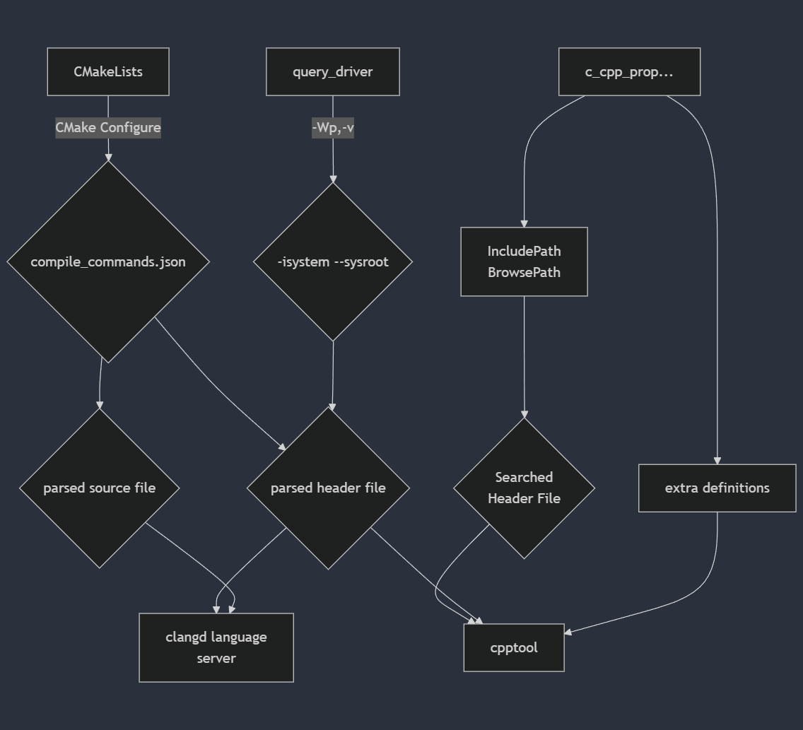
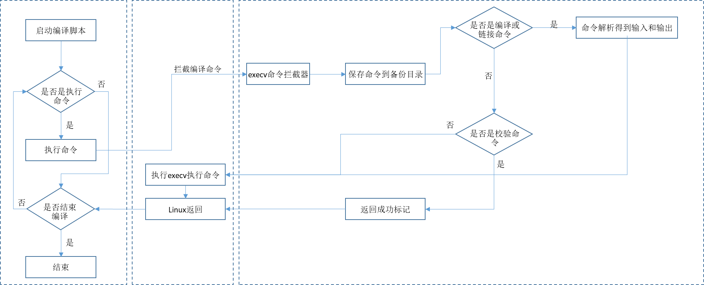

# 在STM32CubeMX创建的CMake工程中使用VSCode写代码

1. [环境配置](#环境配置)
2. [VSCode配置](#vscode配置)
   1. [安装插件](#安装插件)
   2. [配置语言服务器插件](#配置语言服务器插件)
      1. [编译数据库](#编译数据库)
      2. [配置CMake](#配置cmake)
      3. [配置Clangd和Cpptool](#配置clangd和cpptool)
   3. [配置文件](#配置文件)
3. [编译烧写配置](#编译烧写配置)

## 环境配置

需要事先安装到环境变量的工具:

1. arm-none-eabi交叉编译工具链
   1. xPack gcc
   2. arm-llvm
   3. arm官方提供gcc(不建议)
2. DAP上位机
   1. OpenOCD
   2. PyOCD(需要先安装python3)
3. CMake
4. busybox
   1. GNU make for Windows64
   2. ninja

除了独立安装上述工具之外, 也可以直接安装PlatformIO IDE, 然后在PlatformIO IDE中安装STM32 Platform, 这时便会在用户目录下下载上述的所有工具. 但是PlatformIO的构建系统可自定义参数很少, 无法通过手动修改CMakeLists的方式将`-isystem`路径添加到`compile_commandss.json`中.

## VSCode配置

### 安装插件

1. Microsoft C/C++
2. Clangd
3. Microsoft CMake
4. CMake Language Support (1)

> (1) 在安装CMake tools插件后, 务必卸载`twxs.cmake`插件! 这个插件的代码提示能力基本为零, 而且还会 **aggressively** 地安装到VSCode中, 影响CMake文件的正常工作

### 配置语言服务器插件

在打开工程之后, 不出意外的话你会看到源文件和头文件中充斥着大量的红波浪线. 这是因为Cpptools和Clangd均属于 *语言服务器(Language Server, LS)*, 它们依据编译数据库中每个文件附带的编译选项, 对相应的源文件进行编译, 从而获得AST用于代码提示和错误检查.



由于没有正确地配置项目, 导致这两个插件缺少必要的编译数据库(`compile_commands.json`)文件, 因此无法对头文件和库文件进行索引.

#### 编译数据库

编译数据库是由生成工具, 如`bear make`、`cmake`或`ninja build`等, 导出的JSON表, 包含每个源文件/头文件对应的绝对路径、编译选项、输出目录等结构化编译数据, 一般具有以下的格式:

```json
[
  ...,
  {
  "directory": "D:/Electronics/stm32/lab/lab_led/build/Debug",
  "command": "D:\\embedded_toolchains\\arm-none-eabi\\bin\\arm-none-eabi-gcc.exe -DDEBUG -DSTM32F103xE -DUSE_HAL_DRIVER -ID:/Electronics/stm32/lab/lab_led/cmake/stm32cubemx/../../Core/Inc -IC:/Users/Falke/STM32Cube/Repository/STM32Cube_FW_F1_V1.8.6/Drivers/STM32F1xx_HAL_Driver/Inc -IC:/Users/Falke/STM32Cube/Repository/STM32Cube_FW_F1_V1.8.6/Drivers/STM32F1xx_HAL_Driver/Inc/Legacy -IC:/Users/Falke/STM32Cube/Repository/STM32Cube_FW_F1_V1.8.6/Drivers/CMSIS/Device/ST/STM32F1xx/Include -IC:/Users/Falke/STM32Cube/Repository/STM32Cube_FW_F1_V1.8.6/Drivers/CMSIS/Include -mcpu=cortex-m3  -Wall -Wextra -Wpedantic -fdata-sections -ffunction-sections -O0 -g3 -mcpu=cortex-m3  -Wall -Wextra -Wpedantic -fdata-sections -ffunction-sections -O0 -g3 -g -std=gnu11 -o CMakeFiles\\lab_led.dir\\Core\\Src\\gpio.c.obj -c D:\\Electronics\\stm32\\lab\\lab_led\\Core\\Src\\gpio.c",
  "file": "D:\\Electronics\\stm32\\lab\\lab_led\\Core\\Src\\gpio.c",
  "output": "CMakeFiles\\lab_led.dir\\Core\\Src\\gpio.c.obj"
 },
 ...
]
```

生成工具导出编译数据库一般通过直接解析项目文件或者拦截并记录编译命令的方式, 例如`bear`工具用下图所示的流程产生编译数据库:



而CMake会一边解析CMakeLists一边生成编译数据库.

#### 配置CMake

STM32CubeMX生成的CMake工程默认开启`compile_commands.json`的生成. 但是, 打开任意一个源文件后, 仍然会发现大量宏定义无法解析或解析错误, 有时还会报错缺少头文件, 或者在STM32工程中引用VS2022的头文件. 经过查阅大量文档和issue tracker, 以下3个措施可以有效解决此问题:

1. 配置将`compile_commands.json`复制到项目根目录
2. 让CMake Configure时生成正确的`sysroot`
3. 检查是否有 *缺失的文件*

-----

由手册得知, Clangd寻找编译数据库的方式不是从项目根目录向下遍历, 而是从目标文件向上遍历, 默认配置下生成到`build`或`build/${mcuSeriesName}`目录下的编译数据库很难被Clangd找到. 因此, 可以通过VSCode扩展配置

```json
{
  "cmake.copyCompileCommands": "${workspaceFolder}/compile_commands.json"
}
```

或者CMake配置

```cmake
add_custom_target( # 增加一个没有输出的目标
  copy-compile-commands ALL # 增加到默认构建目标, 使得它总是被构建
  ${CMAKE_COMMAND} -E copy_if_different
  ${CMAKE_BINARY_DIR}/compile_commands.json
  ${PROJECT_SOURCE_DIR}
  )
```

使得每次`cmake build`后`compile_commands`都会被复制到项目根目录.

-----

在使用CMake构建交叉编译工程时, 直接`cmake build`得到的编译数据库中缺少交叉编译器的system includes和system root信息, 导致LS找不到正确的标准库. 查阅gcc的man page得知可以用`gcc -x c++ -Wp,-v <任意文件名>`获取gcc的system include, 据此即可用CMakeLists执行外部命令行的方式获取这些system include目录:

```cmake
if(CMAKE_EXPORT_COMPILE_COMMANDS)
    # This dreadful mess is to communicate to clang-tidy the C++ system includes. It seems that CMake
    # doesn't support using its own compile_commands.json database, and that clang-tidy doesn't
    # pick up non-default system headers.
    string(LENGTH ${TOOLCHAIN_PREFIX} PREFIX_LENGTH)
    MATH(EXPR PREFIX_LENGTH "${PREFIX_LENGTH}-1")
    string(SUBSTRING ${TOOLCHAIN_PREFIX} 0 ${PREFIX_LENGTH} TOOLCHAIN_TRIPLE)
    # above is specific for STM32CubeMX target triple variable
    execute_process(
            COMMAND cmd.exe /c ${CMAKE_C_COMPILER} -x c++ -Wp,-v 1 2>&1 | grep "^ .*${TOOLCHAIN_TRIPLE}.*"
            OUTPUT_VARIABLE COMPILER_HEADERS
            OUTPUT_STRIP_TRAILING_WHITESPACE
    )
    message(NOTICE "Find system includes: ${COMPILER_HEADERS}")
    string(REGEX REPLACE "[ \n\t]+" ";" INCLUDE_COMPILER_HEADERS ${COMPILER_HEADERS})

    set(CMAKE_C_STANDARD_INCLUDE_DIRECTORIES ${INCLUDE_COMPILER_HEADERS})
    set(CMAKE_CXX_STANDARD_INCLUDE_DIRECTORIES ${INCLUDE_COMPILER_HEADERS})
endif()
```

> 由于`findstr.exe`和CMake `execute_process()` 命令存在兼容性问题, 因此应当使用busybox或者gnuwin32提供的`grep.exe`进行字符串查找.

在CMakeLists中进行上述配置后, 便可以尝试F7或者在终端中`mkdir build && cd build && cmake .. -G "Unix Makefiles" && make -j`编译项目. 这一步是为了检查STM32CubeMX生成的项目结构是否正确, 如果编译出错, 检查项目根目录下`cmake/stm32cubemx/CMakeLists.txt`中是否漏掉了`Core/Src`中的头文件、源文件, 以及宏定义是否正确.

#### 配置Clangd和Cpptool

Clangd和Cpptool各有优缺点, 例如Clangd对源文件的解析能力更强, 可以准确解析多个文件嵌套的复杂宏定义, 而Cpptool在正确设置包含路径后找头文件的能力更强, 因此最好同时启用两个扩展.

为了让Clangd正确索引包含路径, 可以采取以下两个措施:

1. 配置 `query-driver`
2. 将合适的宏定义添加到 `.clangd` 和 `.clang-tidy` 文件中

以下4个措施能够让Cpptool采用正确的宏定义和包含路径:

1. 从cmake文件中找到正确的头文件目录(VSCode头文件设置的大坑)
2. 手动配置正确的宏定义
3. 配置提供源和compile_commands
4. 将sysroot正确传参到cpptool后端clang-tidy

Clangd使用`query-driver`命令行选项指定其后端, 当不指定时就会从环境变量中选择优先级最高(最靠前)的、且受Clangd支持的编译器. 为了让Clangd正确地找到交叉编译工具链的`arm-none-eabi-gcc`, 需要手动指定这个gcc的名称和绝对路径.

### 配置文件

工作区定义文件 `*.code-workspace`:

```json
{
  ...,
  "settings": {
    "typescript.tsc.autoDetect": "off",
    "clangd.arguments": [
      "--all-scopes-completion",
      "--background-index",
      "--background-index-priority=low",
      "--completion-parse=auto",
      "--completion-style=detailed",
      "--enable-config",
      "--header-insertion-decorators",
      "--header-insertion=iwyu",
      "--pch-storage=memory",
      "--parse-forwarding-functions",
      "--query-driver=<你的工具链根目录>/bin/arm-none-eabi-gcc,<你的工具链根目录>/bin/arm-none-eabi-g++",
      "--ranking-model=decision_forest",
      "-j=24",
      "--log=error"
    ],
    "files.associations": {
      ".clang-format": "yaml",
      ".clang-tidy": "yaml",
      ".clangd": "yaml"
    },
    "cmake.copyCompileCommands": "${workspaceFolder}/compile_commands.json",
    "C_Cpp.default.browse.limitSymbolsToIncludedHeaders": true,
    "clangd.detectExtensionConflicts": false,
    "C_Cpp.intelliSenseEngine": "default",
    ...
  }
}
```

## 编译烧写配置